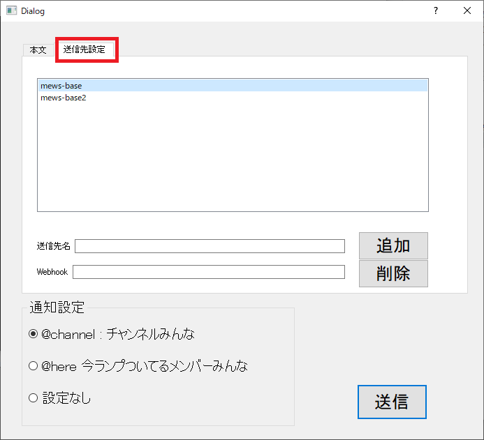

# SlachMchPost

Slack のいろんなワークスペース・チャンネルに`@channel` とか`@here` とかでメッセージ飛ばすツール

## 使い方

### ダウンロード

1. [releases](https://github.com/mews-iidx/SlachMchPost/releases/tag/1.1) から、`dist-1.1.zip`をダウンロード
1. dist.zipを解凍(展開)

### 実行

main.exe 実行

### 送信先の設定

ここにある一覧に対して全送信します。
1. 送信先設定タブをクリック
1. 送信先名を入力
1. webhookを入力
1. 追加ボタンをクリック

### 送信

1. 本文タブをクリック
1. 本文を入力
1. 通知設定を選択
1. 送信ボタンをクリック

## v1.1 新機能!!

* 送信先設定実装！
    - textファイルをいじらなくて良くなりました
* エラーハンドル追加
    - なぜか落ちることが大幅に減りました
