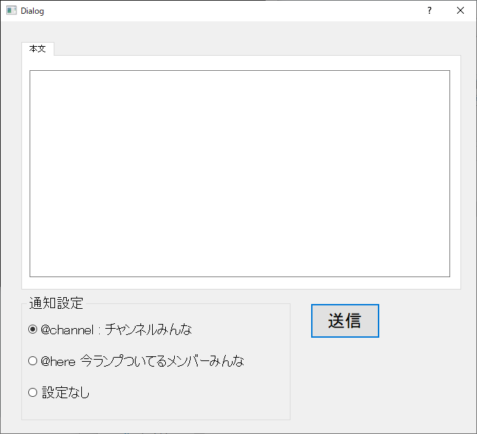

# SlachMchPost

Slack のいろんなワークスペース・チャンネルに`@channel` とか`@here` とかでメッセージ飛ばすツール

## 使い方

1. [リリース一覧](https://github.com/mews-iidx/SlachMchPost/releases) から、`dist.zip`をDLして解凍
1. 解凍後ディレクトリの`configs/url_list.txt` を好きなように編集 ※要Incoming webhook
1. main.exe 実行、あとはわかる！
